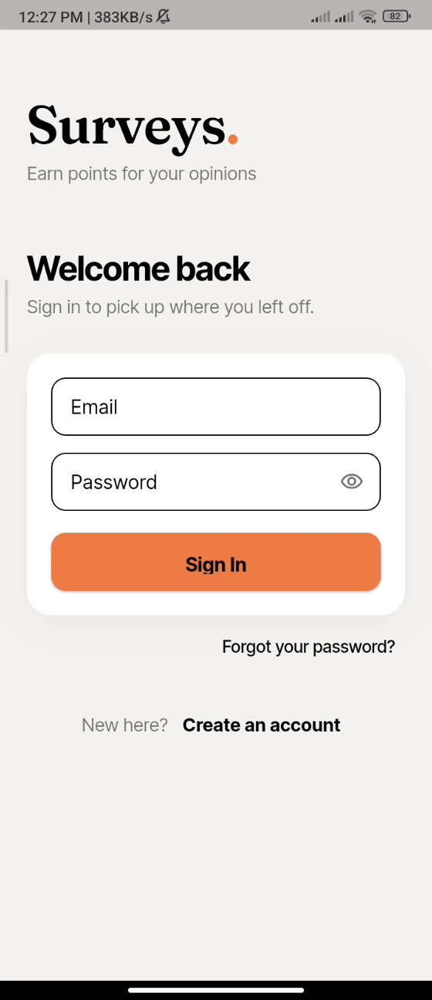
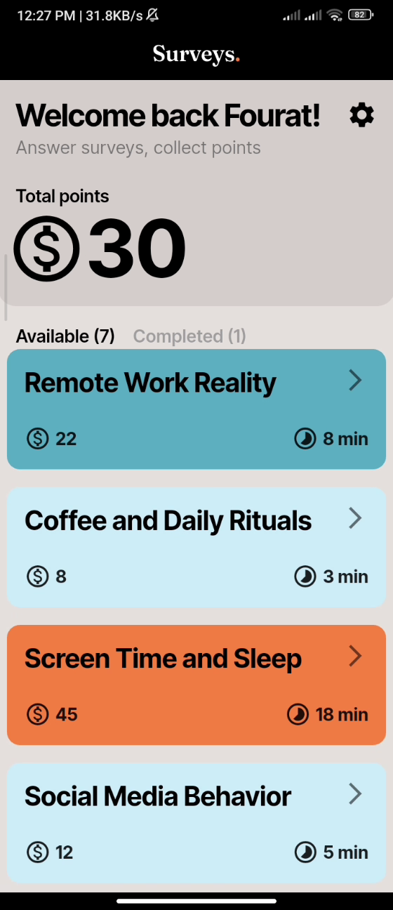
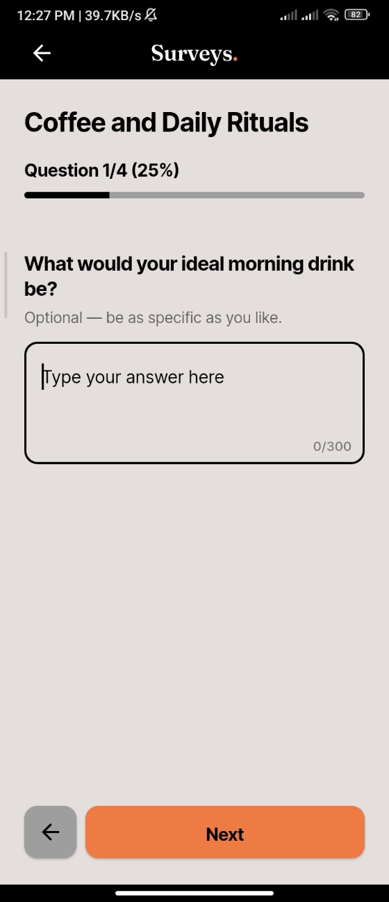
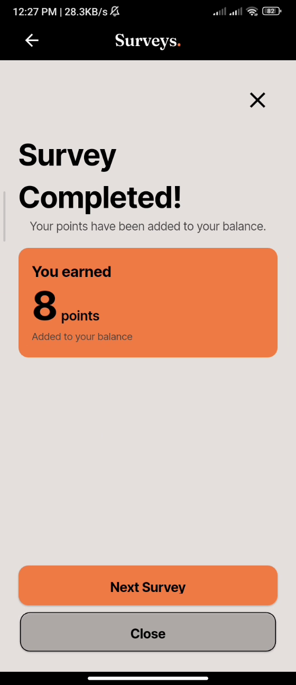

# Surveys

A mobile app where users browse surveys, answer questions, and earn points on completion.

Built with [Flutter](https://flutter.dev) and [Supabase](https://supabase.com).

> **Design credit.** The interface is based on the
> [Surveys Mobile App UX/UI concept](https://www.behance.net/gallery/240406327/Surveys-Mobile-App-UXUI?tracking_source=curated_galleries_ui-ux)
> on Behance. All Flutter and Postgres implementation is my own; the visual
> design is reproduced here for a non-commercial portfolio piece.

---

## Screenshots

_Not captured yet._ Drop PNGs into `docs/screenshots/` — sign-in, survey list, a question, and the reward screen — then uncomment the table below.

<!--
| Sign in | Surveys | Question | Reward |
| :-----: | :-----: | :------: | :----: |
|  |  |  |  |
-->

---

## Getting started

```bash
git clone <this repo> && cd surveys
flutter pub get
```

Set up your environment:

```bash
cp assets/.env.example assets/.env
```

Fill in your Supabase credentials in `assets/.env`:

```
SUPABASE_URL=https://<your-project>.supabase.co
SUPABASE_PUBLISHABLE_KEY=sb_publishable_...
```

Push the database schema:

```bash
supabase link --project-ref <your-project-ref>
SUPABASE_DB_PASSWORD='...' supabase db push
```

That runs both migrations: the schema, functions and policies, then the survey
catalogue. Both are idempotent.

Run the app:

```bash
flutter run
```

---

## How it works

### User flow

Sign in, pick a survey from the list, answer questions one at a time, and submit. Your points are credited automatically on completion. That's the whole loop.

### Points are derived, not stored

There is no balance column. A user's points are the sum of the rewards of the surveys they have completed:

```dart
static int pointsFrom(List<Survey> completed) =>
    completed.fold(0, (total, survey) => total + survey.reward);
```

This means there is no counter to drift out of sync, no column for a client to tamper with, and the number on screen can never disagree with the list underneath it. The completed responses _are_ the ledger.

### Submission is server-side

The client never writes to `survey_responses` or `answers` directly. Everything goes through a single `SECURITY DEFINER` function:

```sql
submit_survey(p_survey_id uuid, p_answers jsonb) returns jsonb
```

Before writing anything it checks that the caller is authenticated, the survey is published, every answered question belongs to that survey, every required question has an answer, and every option id belongs to the question it is attached to. Then it writes the response and its answers together.

Failures come back as named errors — `already_submitted`, `missing_required_answers`, `invalid_option` — which the client maps to typed error values rather than parsing raw database strings in the UI.

### Row Level Security

Survey content is readable by any signed-in user and writable by nobody through the API — admins edit in the Supabase dashboard, which uses the service role and bypasses RLS. Responses and answers are readable only by their owner and writable only by `submit_survey()`.

Because points are derived from completed responses, being unable to forge a response means being unable to forge points.

### Nine question types

`short_text`, `long_text`, `single_choice`, `multiple_choice`, `slider`, `number`, `decimal`, `email`, `phone` — each with its own widget, validation, and answer column.

### Admin-managed content

There's no authoring UI in the app. Surveys are created and edited directly in the Supabase dashboard. For this project's scope, an admin panel would have been more work than the app itself.

---

## Stack

|             |                                  |
| ----------- | -------------------------------- |
| **App**     | Flutter / Dart                   |
| **Backend** | Supabase (Postgres, Auth, RLS)   |
| **Fonts**   | Inter Tight + Fraunces (bundled) |

No state-management package — screens own their state and talk to two service classes (`AuthService`, `SurveyService`). No routing package — `MaterialApp.home` switches on an auth-state enum.

---

## Database

```
surveys ──< questions ──< options
   │            │            │
   │            └────────────┼──< answers >── survey_responses ──> auth.users
   └───────────────────────────────────────────────────────┘
```

| Table               | Notes                                                                     |
| ------------------- | ------------------------------------------------------------------------- |
| `surveys`           | `duration`, `reward`, `is_published`; `length` kept in sync by trigger    |
| `questions`         | `order_index`, `is_required`, `type`, slider bounds, `max_length`         |
| `options`           | `order_index`, `label`                                                    |
| `survey_responses`  | `user_id` defaults to `auth.uid()`; `UNIQUE (survey_id, user_id)`        |
| `answers`           | One of `text_answer` / `number_answer` / `option_id` / `option_ids`, enforced by CHECK |
| `profiles`          | `full_name`, created by trigger on signup; readable and editable only by its owner |

Two database functions:

- `get_available_surveys()` — published surveys the caller hasn't completed yet.
- `submit_survey(uuid, jsonb)` — validates and writes the full submission in one transaction.

---

## Project layout

```
lib/
  core/
    constants/     colors, enums, motion
    models/        Survey, Question, Option, SurveySubmission
  screens/         auth (4), home, profile, survey intro/steps/outro
  services/        AuthService, SurveyService
  shared/
    questions/     one widget per question type
    widgets/       button, text field, cards, tiles, wordmark, motion helpers
assets/
  email-templates/ custom HTML email templates for Supabase
  .env             Supabase credentials (not committed)
fonts/
  Fraunces-VariableFont_wght.ttf
supabase/
  migrations/      schema + policies, then seed content
```

---

## Motion

Animation is used to confirm, not decorate. Durations and curves live in one place (`lib/core/constants/motion.dart`) and every animated widget routes its duration through `AppMotion.of(context, ...)`, which collapses to `Duration.zero` when the platform's _reduce motion_ setting is on.

| Where                 | What                                                             |
| --------------------- | ---------------------------------------------------------------- |
| Every button and card | Press-in scale, sized to the surface                             |
| Survey steps          | Slide and fade, direction following Next or Back                 |
| Progress bar          | Tweens to the new value instead of jumping                       |
| Choice chips          | Fill, border weight and label weight animate together            |
| Survey list           | Staggered entrance, capped after the first few cards             |
| Reward screen         | The points figure counts up, in tabular figures so it doesn't jitter |

---

## Roadmap

- [ ] Redemption — spend points on rewards
- [ ] Deep-linked password reset
- [ ] Draft persistence — resume a survey later
- [ ] Tests and CI

---

## Licence

Code is mine and free to read. The visual design belongs to the author of the
[Behance concept](https://www.behance.net/gallery/240406327/Surveys-Mobile-App-UXUI?tracking_source=curated_galleries_ui-ux) it is based on, and is reproduced for a non-commercial portfolio piece only.
